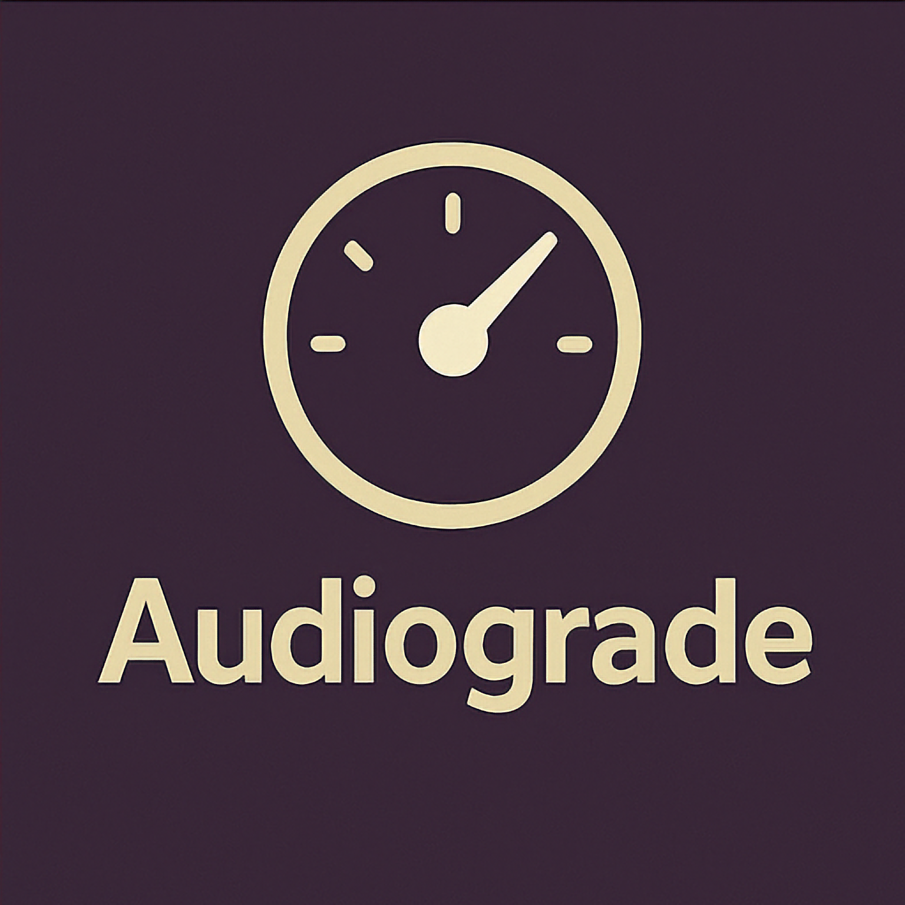
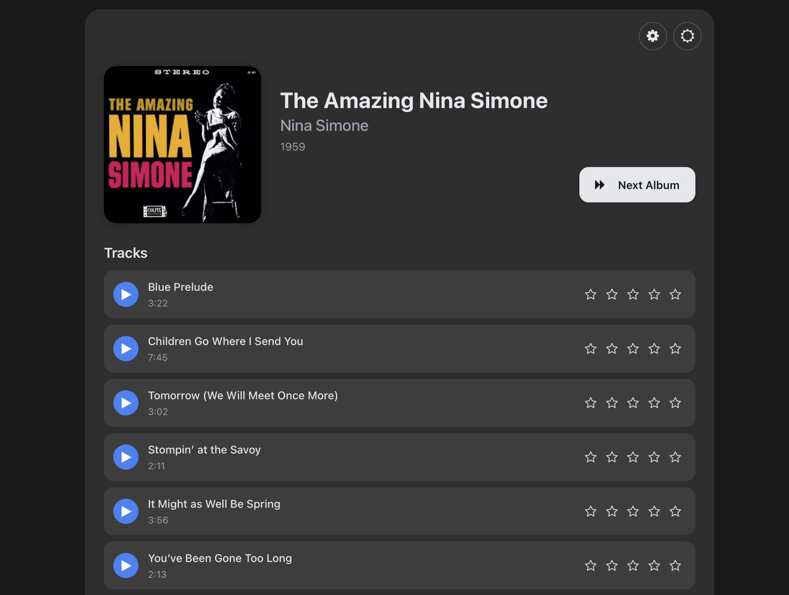
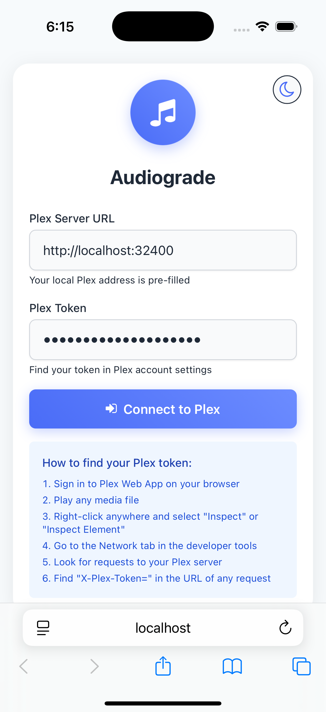
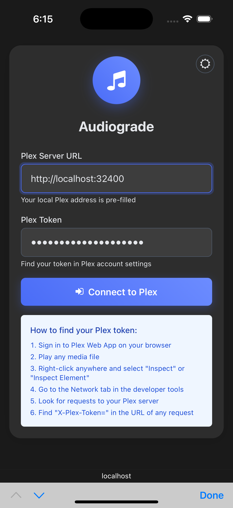
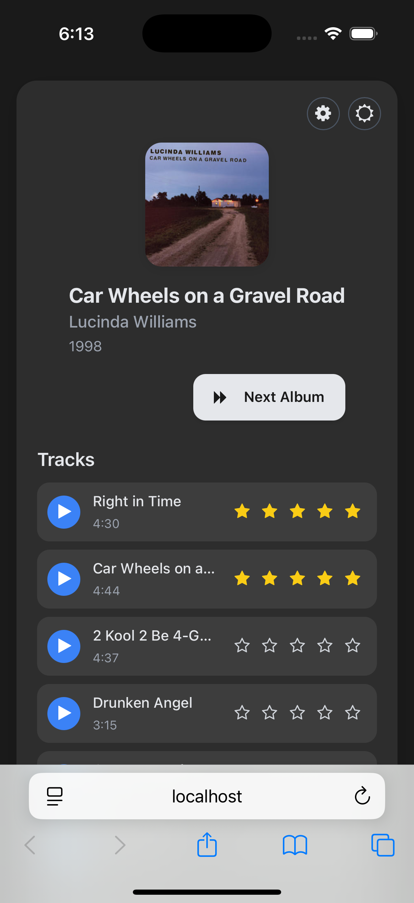

# Audiograde



A modern web application that helps you rate unrated music tracks in your Plex Media Server library. Find and rate albums with unrated tracks to enhance your music collection metadata.

## Features

- 🎵 Browse albums with unrated tracks in your Plex music library
- ⭐ Rate tracks directly through an intuitive interface
- 🎧 Preview tracks (if available in your Plex setup)
- 🌙 Dark/light theme toggle for comfortable viewing
- ⚙️ Customizable album selection criteria:
  - Select albums by percentage of unrated tracks
  - Select albums by number of unrated tracks
- 🔄 Easy navigation between albums
- 🔒 Your Plex token stays in your browser (localStorage)

## Screenshots

### Desktop View


### Setup Screen


### Setup (Dark Mode)


### Rating Screen


## Getting Started

### Prerequisites

- A Plex Media Server with music libraries
- A modern web browser
- Node.js and npm (for development)

### Installation

1. Clone the repository
   ```
   git clone https://github.com/yourusername/audiograde.git
   cd audiograde
   ```

2. Install dependencies
   ```
   npm install
   ```

3. Start the development server
   ```
   npm start
   ```

4. Open your browser and navigate to `http://localhost:3000`

### Building for Production

To create an optimized production build:

```
npm run build
```

The build artifacts will be stored in the `build/` directory.

### Generating Icons

The repository includes a logo file at `public/logo.png`. To generate the necessary icons for production use:

1. Use an online tool like [PNG to ICO converter](https://convertico.com/) to create a favicon
2. Generate sizes 192x192 and 512x512 for Progressive Web App support
3. Place all generated files in the `public/` directory

## Usage

### Connecting to Plex

1. Launch the application
2. Enter your Plex server URL (e.g., `http://192.168.1.100:32400`)
3. Enter your Plex authentication token
4. Click "Connect to Plex"

### Finding Your Plex Token

You can find your Plex token by:
1. Signing in to Plex Web App on your browser
2. Playing any media file
3. Right-clicking anywhere and selecting "Inspect" or "Inspect Element"
4. Going to the Network tab in the developer tools
5. Looking for requests to your Plex server
6. Finding "X-Plex-Token=" in the URL of any request

For more detailed instructions, see the [SETUP.md](SETUP.md) file.

### Rating Albums

1. Once connected, the app shows an album with unrated tracks
2. Click on the stars (1-5) next to each track to rate it
3. Ratings are saved automatically
4. Click "Next Album" to load another album with unrated tracks

### Customizing Album Selection

1. Click the gear icon in the top right to open Settings
2. Choose your music library if you have multiple
3. Select how to filter albums:
   - By percentage of unrated tracks (e.g., show albums with at least 50% unrated tracks)
   - By count of unrated tracks (e.g., show albums with at least 3 unrated tracks)
4. Click "Save Settings" to apply your changes

### Resetting the App

If you need to reset your settings or change your Plex server:
1. Navigate to `/reset.html` in your browser
2. Click "Reset All Settings"
3. You'll be returned to the login screen

## Testing

This project includes comprehensive tests for both components and services:

```
npm test
```

To run tests with coverage reporting:

```
npm test -- --coverage
```

## Technical Details

### Stack

- React for the user interface
- Jest and React Testing Library for testing
- CSS3 with CSS variables for theming
- Lucide React for icons

### Architecture

- `PlexService.js` - Service for interacting with the Plex API
- `App.js` - Main React component
- Local storage for persisting user preferences and connection details

### Fixes

- **Icon Display Issue**: If icons are not displaying correctly, ensure that `app.css` is imported in `src/index.js` to load Tailwind and custom styles. This resolves issues with icon sizing and color-utility rules.

## Future Improvements

- Support for Plex SSO login instead of token authentication
- Mobile app version with React Native
- Integration with additional metadata providers
- Batch rating functionality
- Export/import of ratings

## License

MIT License - See LICENSE file for details

## Acknowledgments

- [Plex](https://www.plex.tv/) for their amazing media server
- [Lucide Icons](https://lucide.dev/) for the beautiful icons
- All contributors and users of this application

---

Made with ♥ for music lovers who organize their collections with Plex 